# Agentonomy Commerce

让 Agent 在用户授权预算内，可靠地购买服务并取得结果。

Agentonomy Commerce contains the Clink runtime for service discovery, spending
mandates, policy checks, budget reservations, payment verification and delivery.
Agents use one `clink_node` MCP entry. The Core controls funds; Marketplace
manages the purchase and returns the result.

## 完整架构与控制边界

这条 hosted commerce 链路把用户钱包、Clink Core、链上预算合约、商家交付
和 ERC-8004 服务身份串在一起。ERC-8004 只负责可复验的服务身份、收款钱包
约束和可选的买方反馈；它不会替代 Core 的授权，也不会给 Agent 增加付款能力。

```mermaid
flowchart LR
    W["Own-wallet browser<br/>EIP-191 login + HttpOnly cookie"]
    G["Core finite spending grant<br/>EIP-712 + finite approve"]
    O["Canonical OPC install<br/>server-owned Agent + short-lived token"]
    N["real clink_node MCP<br/>actual Node MCP SDK"]
    M["Marketplace<br/>discover / quote / purchase / delivery"]
    I["ERC-8004 identity/payee guard<br/>owner / wallet / URI / code"]
    C["Core<br/>policy/risk / reservation / recheck"]
    K["isolated KMS<br/>fixed execution + gas scope"]
    B["budget contract<br/>EIP-712 limits / revoke / replay"]
    V["2-RPC Watcher<br/>canonical finality + events"]
    R["signed Core receipt"]
    H["HTTP merchant<br/>receipt + input-hash check"]
    D["delivery result + output hash"]
    F["optional buyer wallet<br/>ERC-8004 feedback signature"]
    P["Reputation registry<br/>exact tx + two-RPC verification"]

    W --> G --> O --> N --> M --> I --> C --> K --> B --> V --> R --> H --> D
    D -. optional .-> F --> P
```



完整流程按以下顺序执行：

1. 用户用自己的钱包签署绑定站点和会话的 EIP-191 challenge。服务端只保留
   会话/CSRF 摘要并发 Secure、HttpOnly 登录 cookie；CSRF 值可供页面读取，
   用于防止跨站请求。浏览器不接收 Agent bearer token、KMS 凭据、私钥或助记词。
2. Core 根据这个钱包建立有限的 Spending Grant。用户另行在钱包中签署 EIP-712
   链上预算授权，并对预算合约设置有限的 ERC-20 allowance。登录不会续期、
   重置或扩大已经签署的授权。
3. 用户签署 hosted Agent 的安装同意。Canonical OPC 在服务端安装由服务端
   管理的 Agent，并在内部交换短时凭据；短 token 不离开服务端进程边界。
4. Agent 只能通过实际发货的 `clink_node` MCP 和 Node MCP SDK 请求能力。它
   不导入 Clink sibling checkout，也不绕过 Node 直接取得 Core 权限。
5. Marketplace 发现固定的 CSV reconciliation 服务，冻结报价、输入和
   `purchase_id`，负责 purchase 幂等与最终交付；它不能自选预算、payee 或
   任意商家 URL。
6. 对每一笔新购买，ERC-8004 adapter 在同一个可复验边界读取 Identity 和
   Reputation 相关 registry，核对 `agent_id`、owner、agent wallet、URI、
   chain、运行时代码/代理实现和固定收款方。收款 wallet 必须等于当前
   network payee，任何漂移都会阻止新购买。
7. Core 重新执行 identity、policy/risk、预算预占、执行前复验和 audit。ERC-8004
   检查通过也不等于 Spending Grant 或风险检查通过。
8. 通过隔离的 KMS/执行签名路径生成固定订单的执行签名并支付 gas。密钥、
   nonce、network、交易接收方和 gas 范围由受保护的部署配置固定，不能由
   浏览器、Agent 或商家选择。
9. Budget contract 以用户签署的 EIP-712 grant 和执行签名落实单笔/总额上限、
   有效期、撤销和跨 grant 的 purchase replay guard；它是硬上限，不是第二个
   Core 账本。
10. 两个独立 RPC 的 watcher 同时核对完整 calldata、成功 receipt、canonical
    block、最终性边界、`PaymentExecuted` 和 ERC-20 `Transfer`。单个 RPC、
    商家 HTTP 200 或 relayer 返回的 tx hash 都不能单独证明付款成功。
11. Core 根据这份独立证据签发收据。HTTP merchant 校验收据的 scope、金额、
    payee、purchase ID 和 Core 保存的输入 hash，然后只返回固定交付结果及其
    SHA-256 `output_hash`。
12. 如果付款已确认而交付失败，恢复只重试同一个已付款订单的交付。服务身份
    发生变化时，旧订单仍可按原始 payment proof 和 delivery 状态恢复；任何
    可能再次发起付款的恢复路径，都必须重新经过与 execute 相同的 identity、
    policy、reservation 和执行复验，不能借恢复名义重复扣款。
13. 买方可选地在确认交付后用自己的钱包签署 ERC-8004 feedback。服务端冻结
    每个 tenant/order 的 canonical feedback 文档和 calldata，保存原始提交的
    tx hash，只有双 RPC 独立验证精确的买方、registry、calldata、零 value、
    receipt/finality、`NewFeedback` event 和链上 feedback state 后，才公开
    feedback JSON。刷新页面不会自动签名、发送或替换交易。

这里有两个必须区分的身份。服务的 `serviceAgent` 是 Identity registry 中的
ERC-721/`agent_id`，描述谁提供服务以及哪个 receiving wallet 应该收款；它不
代表买方的权限。买方身份来自 own-wallet EIP-191 proof 和 Core owner proof，
买方能否消费由 Core 的 grant、policy/risk、reservation 和链上 allowance
共同决定。反馈流程中的 ERC-8004 owner/operator 检查用于阻止服务方给自己
评分；它不会授予消费预算，也不会改变商家或收款地址。

组件职责保持单向边界：Core 是 wallet identity、Spending Grant、policy/risk、
funding、reservation 和 audit 的唯一控制面；Node 是 Agent 的统一 MCP 入口；
Marketplace 管发现、报价、purchase 和交付；ERC-8004 adapter 只做 operator-pinned
registry 读取、身份/payee guard 和反馈验证；KMS/relayer 只在固定范围内签名或
转发；budget contract 落实用户签署的硬上限；watcher 独立验证链上事实；HTTP
merchant 只验证已签收据并交付结果。当前集成使用 Identity + Reputation；
ERC-8004 Validation 仍是未来工作。registration-v1 metadata 的
`x402Support` 固定为 `false`、`supportedTrust` 只声明 `reputation`，不会伪造
公共 MCP endpoint 或 x402 能力。

ERC-8004 的配置、来源 pin、CLI、反馈隐私和失败/恢复边界见
[ERC-8004 setup and operations](docs/monad/erc8004.md)。截至 2026-10-08，最新
release gate 记录为 Monad pytest 592 passed（45.11 秒）和 21 个 canonical
Core budget tests passed（2.34 秒）。`make test-contracts` 64、`make
test-commerce` 25、`make test-review` 76、`make test-submission` 6、canonical
Core OPC 108 和 Node OPC/MCP 121 是此前记录的门禁；这里不宣称它们在本次
rollout 中重新完整运行。跨页面发送、未知结果恢复、服务端原交易哈希恢复及旧
页面回归的 32 项测试已通过独立复核；本地匿名浏览器检查未见控制台错误。

ERC-8004 的本地链测试使用 chain 31337 上明确标注的 test-only Solidity registry
fixture；两个观察路径复用同一个 Anvil endpoint。它只证明 adapter 的接口、ABI、
event 和失败边界，不是官方 proxy、live independent RPC、Monad live registry，
也不是完整 Core acceptance。当前 rollout 已有独立的 review VM 部署、Monad
合约双 RPC 验收、ERC-8004 registration proof 和外部 HTTPS identity probe；
这些 live 证据与本地 fixture 分开记录。真实部署必须使用 HTTPS 和配置中完全
一致的 origin。当前仍未完成用户钱包 purchase/recovery、revoke、two-wallet、
feedback 和 video acceptance；本文不宣称使用官方 USDC。

反馈发送必须经过明确的 `prepare -> inspect disclosure -> send` 顺序：先冻结
买方地址、分数、付款交易和结果摘要，再由用户查看 disclosure 并点击发送。每个
authenticated wallet/order 的 feedback record 使用独立的持久化命名空间，与普通
purchase reference 分开。每个订单另存发送标记，普通状态写入不能清掉该标记；
已知候选哈希从两种记录合并，冲突会阻断。发送前写入的 unknown marker 在刷新或崩溃后保留，防止
自动重发。同一 origin、同一 browser profile 的 tabs 通过 `navigator.locks` 独占
发送锁，并在锁内重新读取 durable record；不支持 Web Locks 或 localStorage 时，
optional feedback sending 和原哈希恢复会拒绝继续。钱包返回 cancellation `4001` 只会在持有
originating lock 的流程内清除 marker。这个协调范围只覆盖同源同 profile，不能看见
其他设备、其他 profile 或 storage 被清除后的 pre-hash unknown attempt；恢复时应
保留原 browser metadata，并先核对原钱包交易。Backend 只在提交 tx hash 后约束原
候选，不宣称跨设备排除 unknown。

## Latest public Monad rollout status

As of 2026-10-08, release `44fdd9fb0d228c2b6b58d4673e8ecb54bf09ba76` is
deployed on the dedicated `agentonomy-commerce-review-01` VM in
`blockchain-nodeservice/asia-southeast1-b`. The systemd web service runs on
loopback `127.0.0.1:8092` behind Caddy at
[`https://review.agentonomy.xyz`](https://review.agentonomy.xyz). The old
simulated Docker service is stopped with its data retained, and its startup
script was removed.

The TestUSD and budget-executor CREATE journals are complete with dual-RPC
receipt, finality, code and constructor checks. The ERC-8004 registration is
complete for Agent ID `2073`; both loopback and external HTTPS `agent.json`
responses are `active=true` with the verified registration metadata. Independent
onchain registration proof binds the URI and receiving wallet. The
fresh external probe verified the HTTPS certificate, returned HTTP 200 for
`/agent.json`, and the well-known registration document matched it; the hosted
wallet page also returned HTTP 200, with the expected connect/OPC-approve
identifiers, CSP and `Cache-Control: no-store`. Anonymous `/api/status`
returned 401. A fresh buyer login, 1.00 TestUSD claim, business-budget and
EIP-712 grant, finite allowance, OPC consent, 0.30 CSV purchase, same-order
recovery, revoke, second-wallet, feedback and video acceptance are also still
pending. The temporary single-IP SSH rule was removed; only the original
`agentonomy-commerce-iap-ssh` TCP/22 rule from `35.235.240.0/20` targeting
`commerce-review-admin` remains, and the web backend exposes only loopback
`127.0.0.1:8092` behind the Caddy HTTPS front end.
The [public rollout acceptance record](docs/monad/public-rollout-acceptance-20261008.md)
contains the public proof, explorer links and exact remaining gates.

## Monad budget-contract implementation

A separate real local-EVM composition now adds an owner-signed EIP-712 budget,
contract-enforced limits/revocation, durable Core execution, independent payment
verification and HTTP delivery. It is self-contained in this repository.
Start with [the quickstart](docs/monad/quickstart.md),
[acceptance record](docs/monad/acceptance.md), and
[public deployment prerequisites](docs/monad/deployment.md).
The [external OKX wallet and dedicated KMS operator path](docs/monad/kms-quickstart.md)
adds bounded signing, wallet setup, and recovery of the original paid order.
The Monad contracts are deployed and verified through both RPCs, and the earlier
OKX canary authorization produced one real 0.30 TestUSD payment on chain 10143.
That historical API order is `delivered`; same-order recovery/query returned the
identical report without a second payment. See [role-session acceptance](docs/monad/role-session-acceptance.md)
and [recording checklist](docs/monad/recording-checklist.md) for the historical
transaction and recovery evidence. It does not replace acceptance of the new
public hosted wallet flow; the new public purchase, recovery, revocation,
two-wallet, feedback, recording and final submission remain pending.

The new own-wallet website implementation is in
`examples/monad_commerce/hosted_*`. It adds browser wallet proof, isolated
account state, a fixed-supply TestUSD claim, finite spending consent, and
wallet-approved Agent installation. The hosted Agent exchanges short-lived
credentials internally and calls the shipped Node through the actual MCP SDK;
the browser never receives an Agent bearer token. All wallets share one durable
relayer gate. Linux signing runs through a separate service user and a fixed
launcher whose key, network, nonce and gas scope cannot be selected by a visitor.
See [public implementation readiness](docs/monad/public-live-readiness.md),
[hosted operations](docs/monad/hosted-operations.md), and the
[ERC-8004 setup guide](docs/monad/erc8004.md). The ERC-8004 implementation has
local verification and the imported regression gates recorded above, including
same-profile cross-tab exclusion and original-candidate recovery. The new release
is deployed on the dedicated review VM and the loopback `agent.json` identity is
promoted after complete registration proof. The public HTTPS identity probe now
passes, including active Agent metadata and the hosted wallet page. Public wallet
purchase/recovery, revocation, second-wallet isolation, feedback and video
acceptance remain pending. The previous deployed contracts and real one-wallet
order above are unchanged and are labelled historical in the
[recording checklist](docs/monad/recording-checklist.md).

公网发布准备还包括一个独立的
[ERC-8004 registration operator](docs/monad/erc8004-registration-operator.md)。
它复用现有 KMS、私有交易 journal 和双 RPC 验证，只允许固定服务 URI 的一次
注册；网页购买 signer 保持原有范围。注册消耗 nonce 5，购买继续使用 nonce
6–13，合计 gas 费用上限保持 1.083 test MON。网页 registry 配置放在 web 用户
自己的受保护目录中，与签名配置和临时 AWS 凭据分开。当前 release gate
记录为 592 个 Monad tests（45.11 秒）和 21 个 canonical Core budget tests
（2.34 秒）通过；64 个 contracts、25 个 Commerce、76 个 Review、6 个
Submission、108 个 Core OPC 和 121 个 Node OPC/MCP 计数是此前记录的门禁，
不在这里宣称重新完整运行。注册工具其中有 40 项局部测试。操作顺序和只读
证据见 [public deployment plan](docs/monad/public-deployment-plan-20261008.md)。
这些准备已经包含新的 review VM 部署、合约 CREATE 和 registration 证据；但
不代表用户钱包 purchase 或完整公网验收已完成。

## Run locally

Use Python 3.12 for the reproducible environment below.

```sh
python3 -m venv .venv
.venv/bin/python -m pip install -r requirements.lock
.venv/bin/python -m pip install --no-deps -e apps/node
make PYTHON=.venv/bin/python test-commerce
make PYTHON=.venv/bin/python demo
```

The local demonstration uses simulated external settlement. It does not spend
real funds, contact production services or require a wallet key/API key. Core
budget accounting and Marketplace purchase transitions use the shipped business
implementation. See [architecture](docs/architecture.md) for the code boundary.

See [demo instructions and MCP client setup](docs/demo.md) for the full flow,
expected evidence and simulated boundaries.

## Persistent review service

This section describes the local review composition and its simulated settlement;
it is separate from the newly deployed hosted Monad release documented above.

The review API provides a **real HTTP CSV reconciliation merchant** over the
same Core authorization and Marketplace purchase logic. Settlement is explicitly
simulated: each report costs 0.30 simulated USDC from a 1.00 simulated USDC
budget. No real funds are spent.

Follow [deployment instructions](docs/deployment.md) to launch the service
locally or build its container. When `AGENTONOMY_DEMO_ORIGIN` is set to the
exact browser origin, opening `/` and clicking **开始演示** creates or restores
an HttpOnly `agentonomy_demo` visitor session. The browser uses
`/demo/session` and `/demo/v1/*`; visitors do not enter or retrieve a review
token. Each visitor has an isolated persistent 1.00 simulated USDC budget,
with 0.30 charged per delivered report. A session lasts seven days; at most
128 sessions are retained and at most 10 new sessions are created per rolling
minute. Refreshing the page or replaying a purchase reuses the same persisted
session and never recharges or resets its budget.

The private machine API remains separate: `/v1/` capabilities still require
the private Bearer review token, and its original persistent review tenant,
budget and order state are not shared with public visitor sessions. The local
public demo is disabled unless its exact origin is configured; for Compose or
the direct local launch, use `http://localhost:8080`.

State persists across restarts. Replaying a purchase preserves its settlement
and result instead of charging again. Reports are retained for seven days;
the private tenant's signed bootstrap grant expires after 30 days and is never
automatically replaced. These are simulated sessions and simulated settlement,
not a multiuser production wallet service.

```sh
make PYTHON=.venv/bin/python test-review test-submission
```

The original stdio MCP demo above is independent and ephemeral. It does not
share the private review tenant, public visitor sessions or CSV service. The
full shipped `clink_node` runtime remains the Agent entry for Core and
Marketplace.

## Hackathon submission

The official submission is [PR #83](https://github.com/xagentAI/xagt-plugin/pull/83).
Its package contains an exact committed source snapshot, SHA-256 manifest,
rights declaration and deployment evidence. The public review site is
[review.agentonomy.xyz](https://review.agentonomy.xyz).

[Submission preparation](submission/README.md) documents the packaging format.
`scripts/package_submission.py --output DIR` deliberately creates a draft;
publication requires fresh deployment and validation evidence for the selected
commit. A submission PR is not an acceptance decision.

See the [two-minute review walkthrough](docs/review-walkthrough.md) for the
demo sequence and the exact boundaries of each claim.

## Existing runtime

The original Node protocol and module names are retained. The full source for
Core, Marketplace, Node, Hosted Facilitator and the USDC executor is included.
Prediction Markets remains as an optional compatibility module and is disabled
for Commerce's local demonstration.

```sh
make PYTHON=.venv/bin/python test-workspace test-node test-e2e
make PYTHON=.venv/bin/python test-apps test-hosted
make test-contracts
```

The existing Personal and Server runtime configuration examples are
`clink.node.example.toml` and `clink.node.server.example.toml`. Connecting real
wallets, RPC endpoints or Hosted signing infrastructure is a separate deployment
step; the local demo does not certify that configuration.

## Source and rights

This is a focused export of the Clink working tree. It has independent Git
history and contains no Clink runtime databases, credentials or private deployment
state. Export hashes are in [source-manifest.json](docs/source-manifest.json).
Original in-file license notices are retained. No additional repository-wide
open-source license has been granted by this export.
