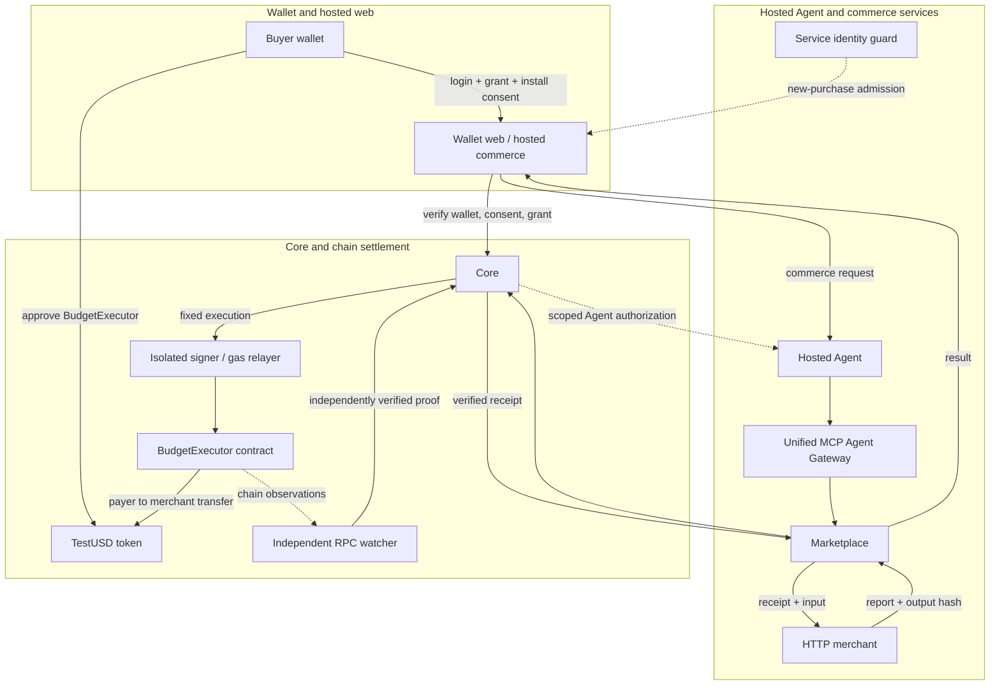

# Agentonomy Commerce

让 Agent 在用户授权预算内，可靠地购买服务并取得结果。

Agentonomy Commerce lets an AI agent buy a service under a budget that the user
has authorized. The system checks the quote, reserves the budget, verifies the
payment independently, asks the merchant to validate the receipt, and returns
the result to the user. The user never gives the Agent a private key.

Wallet demo: [review.agentonomy.xyz](https://review.agentonomy.xyz) · Monad
testnet · valueless test assets.

## The concrete example

The current service is CSV reconciliation. It costs **0.30 test-only,
valueless TestUSD** per report. The owner authorization used by the example is
explicit and finite:

- the wallet claims **1.00 TestUSD**;
- the Core grant allows **1.00 total**, **0.50 per payment**, for **one day**;
- the wallet approves **BudgetExecutor to spend up to 1.00 TestUSD**;
- the Agent can request the fixed **0.30 TestUSD** quote for a report.

The allowance, grant, policy decision, reservation, payment proof, and delivery
are separate records. A replay returns the original order and result instead of
charging again.

The report returns income, expense, net, and category totals. A completed order
records its purchase ID, payment transaction hash, and output hash.

## Architecture

Core is the sole authority for wallet identity, signed spending grants,
policy/risk decisions, funding, reservations, and audit. Marketplace owns
service discovery, quotes, orders, and delivery. The Agent uses one unified MCP
Agent Gateway to request commerce; it cannot call Core or a merchant directly.

In hosted mode, the Agent and its MCP connection run on the server. Visitors
authorize from the wallet site; no publicly reachable MCP endpoint is advertised.



The diagram shows logical components, rather than separate operating-system
processes. Hosted commerce checks service identity before admitting a new
purchase to the Agent/MCP path. Core independently validates the buyer's
authority. The watcher runs under Core; its evidence comes from two independent
RPC providers.

The user journey is:

1. The user logs in with a wallet challenge. The browser receives session
   cookies; the user does not share a private key, seed phrase, or signing
   service credential.
2. The user signs an EIP-712 budget grant, sets a finite token allowance, and
   approves installation of the hosted Agent. The typed grant is signed data
   forwarded through Core; no separate budget-bind transaction is required.
   Short-lived Agent credentials stay inside the server.
3. The server-hosted Agent discovers the available service and receives a
   frozen quote.
4. Before a new purchase is admitted, hosted commerce checks the service
   identity and receiving wallet; Marketplace then requests Core's identity,
   policy/risk, budget reservation, and execution checks.
5. An isolated execution path submits the fixed payment. The BudgetExecutor
   contract enforces the signed limits, expiry, revocation, and purchase replay
   protection. A gas relayer pays testnet gas; the user-funded asset moves from
   payer to merchant.
6. Two independently operated RPC paths verify the exact calldata, receipt,
   canonical finality, and events. Core issues the receipt, the HTTP merchant
   accepts it and produces the report, and Marketplace returns the result. If
   delivery fails after payment, recovery retries delivery for the same paid
   order and never creates a second charge.

## Component boundaries

| Component | Responsibility | Must not decide |
| --- | --- | --- |
| Core | Identity, grant, policy/risk, funding, reservation, audit, and payment receipt | Service catalog or arbitrary merchant selection |
| Marketplace | Discovery, quote freeze, order idempotency, delivery, and recovery | Its own budget, payee, or authorization |
| Agent Gateway | The single MCP surface through which an Agent requests commerce | Direct Core, wallet, or merchant access |
| Service identity guard | ERC-8004 owner, wallet, URI, and code-pin checks | Buyer budget or policy approval |
| Isolated signer / relayer | Signs and forwards a fixed, Core-authorized execution; pays test gas | Quote, payee, amount, or policy changes |
| BudgetExecutor | Applies the user-signed EIP-712 hard limits on chain | Core identity or merchant delivery |
| RPC watcher | Independently verifies chain facts and finality | A payment without matching evidence |
| HTTP merchant | Accepts a valid Core receipt and returns the service result plus output hash | A new payment or a new budget |

ERC-8004 identifies the service: its owner, receiving wallet, metadata URI, and
runtime code pins are checked before a purchase. That identity check does not
grant the buyer a budget and does not replace Core policy or risk approval.
ERC-8004 support covers Identity and Reputation. After a verified delivery, the
buyer may optionally prepare feedback; the original feedback transaction is
verified through both RPC paths before the application exposes the feedback
document. The public document contains the buyer address, score, payment
transaction hash, and result output hash; it excludes the CSV payload. This flow
has local verification; no live feedback acceptance is claimed. ERC-8004
Validation and x402 are outside the implemented scope.

The main integrations are MCP for the Agent boundary, EIP-191 for wallet login,
EIP-712 for grants and executions, ERC-8004 for service identity, and isolated
KMS-backed signing for the execution path. The signer is an execution component;
Core remains the decision authority.

## Evidence status

The following distinction keeps recorded deployment evidence separate from
future public acceptance:

| Evidence | Status |
| --- | --- |
| Local behavior | Tested implementations cover budget limits, expiry, revocation, replay protection, paid-order recovery, execution isolation, and feedback verification. |
| Monad testnet deployment | Recorded on 2026-10-08: two chain-10143 contracts and the ERC-8004 registration for Agent 2073 were deployed; two independently operated RPC paths checked the deployment, and the HTTPS registration metadata was deployed and verified. |
| Fresh public own-wallet acceptance | Pending: purchase, delivery, same-order replay, revoke, and second-wallet isolation still require a new live acceptance run. |

These records do not claim a complete live closed loop, production adoption, or
a security audit. TestUSD has no monetary value.

## Run locally

Use Python 3.12 for the reproducible local simulation:

```sh
python3.12 -m venv .venv
.venv/bin/python -m pip install -r requirements.lock
.venv/bin/python -m pip install --no-deps -e apps/node
make PYTHON=.venv/bin/python test-commerce
make PYTHON=.venv/bin/python demo
```

The demo uses simulated settlement. It does not spend real funds or use the
Monad deployment. It selects a local analysis service for a JSON order list.
Its expected behavior is a **0.30** quote, a delivered order-analysis report,
and a replay of the same order without a second charge; the final budget shows
**0.30 used** and **0.00 reserved**. The CSV wallet flow is a separate testnet
composition.

Run the focused verification targets with the same interpreter:

```sh
make PYTHON=.venv/bin/python test-commerce
make PYTHON=.venv/bin/python test-review
make PYTHON=.venv/bin/python test-contracts
make PYTHON=.venv/bin/python test-monad
```

`test-contracts` and `test-monad` require Foundry. The tests exercise useful
behaviors such as quote and purchase idempotency, receipt validation, delivery
recovery, contract limits, revocation, replay protection, and independent
payment verification.

## Where to look

- [`apps/core`](apps/core): identity, grants, policy/risk, reservations, funding, and audit.
- [`apps/marketplace`](apps/marketplace): discovery, quotes, orders, and delivery.
- [`apps/node`](apps/node): the Agent-facing MCP Gateway.
- [`contracts/src/AgentonomyBudgetExecutor.sol`](contracts/src/AgentonomyBudgetExecutor.sol): EIP-712 budget enforcement and token transfer.
- [`examples/monad_commerce`](examples/monad_commerce): wallet-authorized testnet composition.
- [`tests/commerce`](tests/commerce) and [`tests/monad`](tests/monad): focused behavioral and integration checks.

Existing source-file license notices remain applicable. This README grants no
additional repository-wide license.
