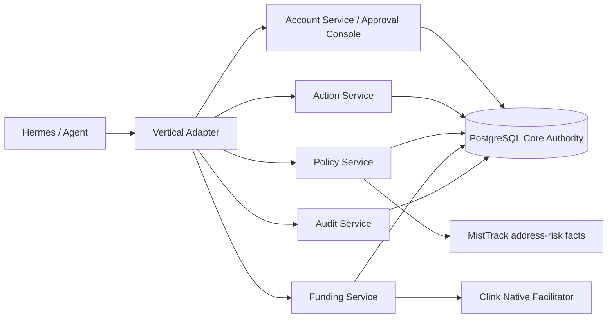

# clink-core

`clink-core` is the production control plane for agentic commerce: account authorization, policy, wallet-safe funding, execution gates, and audit. Hermes never connects to Core directly; vertical adapters submit an exact action scope and Core independently revalidates it before reserving money.

One Core `WalletIdentity` and one signed `SpendingGrant` can authorize both `prediction_markets` and `marketplace`. The signed mandate contains per-transaction, rolling one-hour, daily and total USDC limits plus product, venue, merchant, trust-tier, network and asset scopes, expiry and notification mode. Expanding any signed authority requires a new wallet signature and atomically supersedes the previous overlapping mandate; reducing, pausing or revoking takes effect immediately. Each network still has its own `AssetAllowance`, so Polygon and Base limits remain independently verifiable. Revoking the shared grant makes both products unavailable.

`silent_under_limits` suppresses an extra conversational confirmation only after Core independently rechecks policy, risk, scope and every rolling budget. Compatible EVM x402 v2 merchants can use `clink_payer_proxy`: Core first validates and signs a short-lived merchant-scoped EIP-3009 authorization, then pulls only the approved purchase amount into the Clink Universal Payer before Marketplace submits that authorization. Incompatible merchants fail closed to the per-purchase `external_x402_signature` flow.

Shared Core authorization does not absorb vertical credentials. Polymarket CLOB credentials remain prediction-market specific. Marketplace payment rail selection is automatic and explicit: `clink_allowance` serves Clink-native merchants, `clink_payer_proxy` serves compatible external x402 merchants, and `external_x402_signature` remains the fail-closed fallback. Both automatic rails require the user's per-chain `AssetAllowance` to the configured Core payer.

Marketplace purchases use `reserve -> settle -> reconcile -> finalize/release`. Purchase, action, policy, merchant, quote, network, asset, amount, destination and resource are bound together. A reservation in `payment_submitted`, `settled` or `finalized` cannot be released and reused. Production requires PostgreSQL, a private shared `CLINK_CORE_INTERNAL_API_TOKEN`, and private networking for all internal Core ports. Publish `account_service` through an HTTPS reverse proxy and set `CLINK_ACCOUNT_PUBLIC_BASE_URL` to that exact public origin or base path.

Before native submission, Core persists the signed raw transaction, canonical transaction hash, sender and nonce with `payment_submitted`. `POST /funding/spending-reservations/{reservation_id}/reconcile` is idempotent: confirmed success returns `settled`, a failed receipt returns `retryable` only after the configured confirmation threshold, and network ambiguity remains `pending`. A higher nonce with temporarily missing transaction lookup is still ambiguous and never releases the reservation. Pending native recovery can only rebroadcast the exact same raw bytes. External recovery binds the canonical transaction hash to the validated canonical payment scope; decorative proof fields cannot alter identity, and one chain transaction cannot settle multiple reservations.

External x402 finalize requires a complete `eth_getTransactionByHash` object before it can persist `payment_submitted`: canonical `hash` must equal the requested transaction hash, `to` must exactly equal the reservation's canonical token contract, and `input` must be the fixed ABI encoding of USDC EIP-3009 `transferWithAuthorization`. Every new reservation returns an immutable, unique bytes32 `nonce` and bounded `valid_after`/`valid_before` window; the finalize proof and calldata must match all three exactly. Core rejects RPC errors, missing transaction fields, unknown selectors, non-canonical address words, truncated or trailing arguments, and any payer, recipient, amount, validity bound, or nonce that differs from the reservation and its spending authorization. Reconciliation settles only when both `receipt.transactionHash` and `chain_tx.hash` canonical-equal the reserved hash; a mined response with incomplete or conflicting identity is held for manual review. Legacy reservations without this challenge are read-only and cannot be newly finalized.

Automatic reconciliation is bounded by `CLINK_PAYMENT_RECONCILIATION_MAX_ATTEMPTS` and `CLINK_PAYMENT_RECONCILIATION_MAX_AGE_SECONDS`. An unresolved reservation becomes `manual_review_required` with `next_action=operator_reconcile` while its budget remains held. The internal reconciliation endpoint accepts `{"operator_reconcile": true}` for an authorized operator to perform another idempotent chain check; it never releases an ambiguous payment. Authorization accounting and receipt creation remain idempotent by canonical transaction/reservation identity.

中文定位：

```text
Clink Core 是 Agent 商业动作的权限、资金、策略和审计控制层。
```

It does not scan markets, decide trades, or submit venue orders. Vertical adapters such as `clink-prediction-markets` bring the domain action; `clink-core` answers whether that action is authorized, funded, confirmed, executable, and auditable.

## Production Boundary

```text
Hermes / Agent UX
-> vertical adapter, e.g. clink-prediction-markets
-> clink-core control plane
-> wallet / facilitator / venue-specific executor
```

`clink-core` owns:

- Action intent and approval state.
- Wallet identities, signed cross-product grants, and per-chain asset allowances.
- Budget authorization and remaining budget.
- Policy gates for live execution, risk level, confirmation, and authorization.
- Wallet-approved spending caps.
- Clink Native Facilitator settlement for Polygon and Base USDC `transferFrom` funding.
- PostgreSQL-authoritative append-only audit events and funding receipts.

`clink-core` does not own:

- Prediction-market scanning or ranking.
- Polymarket/Kalshi SDK details.
- Polymarket CLOB credentials and external x402 credentials or signatures.
- User-facing strategy judgment.
- Old provider catalogs, generic payment flows, or Telegram/CLI agent loops.

## Architecture



## Runtime Services

```text
authorization_service        8013
authorization_mcp_server     9013
policy_service               8015
policy_mcp_server            9015
action_service               8016
action_mcp_server            9016
audit_service                8017
audit_mcp_server             9017
funding_service              8018
funding_mcp_server           9018
account_service              8019
```

All service and MCP hosts bind `127.0.0.1` by default. Configure private service networking explicitly when deploying across hosts. Vertical adapters use the stable internal `account_service` URL; browser links are built only from `CLINK_ACCOUNT_PUBLIC_BASE_URL`.

```env
ACCOUNT_SERVICE_HOST=127.0.0.1
ACCOUNT_SERVICE_PORT=8019
CLINK_ACCOUNT_PUBLIC_BASE_URL=https://account.example.com
CLINK_ACCOUNT_SESSION_TTL_SECONDS=900
CLINK_ACCOUNT_ALLOWED_PRODUCTS=prediction_markets,marketplace
CLINK_ACCOUNT_DOMAIN=account.example.com
CLINK_AUDIT_SERVICE_URL=http://audit-service.internal:8017
```

`CLINK_ACCOUNT_PUBLIC_BASE_URL` must not contain credentials, query parameters, or fragments. Production values must use HTTPS at the reverse proxy. `CLINK_AUDIT_SERVICE_URL` is internal and must remain on the private Core network.

Each generated account URL is a one-time credential. The account service consumes it once, redirects to the stable `/account` path, and issues a short-lived `Secure`, `HttpOnly`, `SameSite=Strict` session cookie. Browser mutations also require the matching CSRF cookie/header; reverse proxies must preserve HTTPS and the configured base path.

## Funding Flow

```text
Vertical adapter requests a short-lived Core account URL
-> user binds one wallet with an EIP-191 ownership proof
-> user signs one explicit cross-product SpendingGrant
-> user verifies separate Polygon and Base USDC allowances
-> adapter resolves exact product, network, and asset scope
-> Core binds action, policy, audit, and immutable authorization references
-> funding_service atomically reserves, settles, and records the request
```

Core ships with live funding and the native facilitator disabled. The following
configuration keeps those safe defaults; operators enable them only after the staged
MistTrack rollout described below:

```env
CLINK_LIVE_FUNDING=false
CLINK_RECEIPT_SIGNING_KEY=
# Optional comma-separated canonical EVM addresses. Denylist wins over allowlist.
CLINK_FUNDING_DESTINATION_DENYLIST=
CLINK_FUNDING_DESTINATION_ALLOWLIST=

CLINK_NATIVE_FACILITATOR_ENABLED=false
CLINK_POLYGON_RPC_URL=https://polygon-rpc.example
CLINK_BASE_RPC_URL=https://base-rpc.example
CLINK_POLYGON_USDC_ADDRESS=0x3c499c542cef5e3811e1192ce70d8cc03d5c3359
CLINK_POLYGON_SPENDER_ADDRESS=0x...
CLINK_BASE_USDC_ADDRESS=0x833589fcd6edb6e08f4c7c32d4f71b54bda02913
CLINK_BASE_SPENDER_ADDRESS=0x...
CLINK_NATIVE_FACILITATOR_RELAYER_PRIVATE_KEY=
CLINK_NATIVE_FACILITATOR_GAS_LIMIT=140000
CLINK_FUNDING_SPENDER_ADDRESS=
CLINK_NATIVE_MIN_CONFIRMATIONS=1
CLINK_PAYMENT_RECONCILIATION_MAX_ATTEMPTS=12
CLINK_PAYMENT_RECONCILIATION_MAX_AGE_SECONDS=3600

X402_PAYMENT_NETWORK=eip155:137
X402_PAYMENT_TOKEN=USDC
X402_PAYMENT_TOKEN_ADDRESS=0x3c499c542cEF5E3811e1192ce70d8cC03d5c3359
X402_PAYMENT_TOKEN_NAME=USD Coin
X402_PAYMENT_TOKEN_VERSION=2
X402_PAYMENT_TOKEN_DECIMALS=6
```

`CLINK_NATIVE_FACILITATOR_RELAYER_PRIVATE_KEY` must be a Clink gas relayer wallet, not the user's wallet. Keep only enough native gas token for each enabled network on it.

`CLINK_RECEIPT_SIGNING_KEY` is an independent HMAC secret for authoritative Funding receipts. Generate it separately from `CLINK_CORE_INTERNAL_API_TOKEN` with `openssl rand -hex 32` (32 random bytes, rendered as 64 hex characters) and store each value in the runtime secret manager. Funding rejects missing, shorter-than-32-byte, known placeholder, or internal-token-equal receipt keys; there is no fallback, readiness reports the configuration error, and settlement cannot persist an unsigned authoritative receipt.

`CLINK_LIVE_FUNDING=false` or `CLINK_NATIVE_FACILITATOR_ENABLED=false` is a hard native settlement kill switch. Funding checks both values before allowance RPC work, nonce allocation, signing, initial broadcast, and rebroadcast. Read-only reconciliation of an already user-paid external x402 transaction remains available.

`CLINK_POLYGON_RPC_URL` and `CLINK_BASE_RPC_URL` are independent required endpoints. Core validates `eth_chainId` before every network operation and refuses a missing, unsupported, or mismatched network instead of falling back to another chain.

Production account deployments must configure all four per-chain token/spender values above. The console fails closed if either Polygon or Base is incomplete, and the signed SpendingGrant always binds both canonical token addresses to their corresponding network scopes. In the current native EOA mode, both per-chain spender values and `CLINK_FUNDING_SPENDER_ADDRESS` must match the configured relayer address; Funding readiness fails closed on any mismatch.

`CLINK_FUNDING_SPENDER_ADDRESS` is the address the user approves for capped funding. In the current native EOA mode it should match the Clink relayer address. A dedicated spender contract can replace this later without changing adapter-level tools.

Observed allowance remains `active` while its chain value is greater than zero, becomes `revoked` at zero, and becomes `stale` when refresh RPC fails. Resolution selects only allowances sufficient for the requested amount, and Funding rechecks the current observed allowance against each reservation's exact immutable `amount_atomic` immediately before native submission.

`X402_PAYMENT_TOKEN_NAME` must match the token contract `name()` used by EIP-712, not the ticker symbol. Polygon native USDC uses `USD Coin`.

Use `GET /funding/readiness` to verify production readiness. It returns `universal_payer_ready`, `payer_address`, `automatic_payment_rail`, canonical `supported_assets`, the enforced mandate-limit dimensions, missing config, and the next action. Marketplace must not select `clink_payer_proxy` unless this contract reports ready for the quote's exact network and token.

## Internal Transaction Risk

MistTrack supplies bounded address-risk facts; it never decides whether Clink may spend.
Policy Service is the sole decision surface and applies the versioned
`misttrack-policy-v1` mapping before purchase, trade, subscription, refund, marketplace
purchase, or prediction-market execution actions. Agent, Marketplace, and Prediction
Markets continue through Core and cannot call MistTrack or bypass Policy, Funding, or
Audit. Preview-only actions do not call the provider. Fundable actions require a durable
Action intent, and the request `target_address` and canonical CAIP network must exactly
match the Action metadata `destination` and `network`; metadata cannot supply or override
either value.

```env
CLINK_RISK_PROVIDER=misttrack
CLINK_RISK_MODE=shadow
MISTTRACK_API_KEY=
MISTTRACK_BASE_URL=https://openapi.misttrack.io
MISTTRACK_TIMEOUT_SECONDS=5
MISTTRACK_MAX_ATTEMPTS=2
CLINK_PROFILE=personal
CLINK_REDIS_URL=
MISTTRACK_RATE_LIMIT_REQUESTS_PER_WINDOW=
MISTTRACK_RATE_LIMIT_WINDOW_SECONDS=
CLINK_REDIS_OPERATION_TIMEOUT_SECONDS=1
CLINK_RISK_HOLD_SCORE=31
CLINK_RISK_DENY_SCORE=71
CLINK_RISK_MAX_AGE_SECONDS=300
CLINK_RISK_CACHE_TTL_SECONDS=300
```

Core rejects risk settings above these hard limits:

| Setting | Hard maximum |
|---|---:|
| `MISTTRACK_TIMEOUT_SECONDS` | `30` seconds |
| `MISTTRACK_MAX_ATTEMPTS` | `5` |
| `CLINK_RISK_CACHE_TTL_SECONDS` | `86400` seconds |
| `MISTTRACK_RATE_LIMIT_REQUESTS_PER_WINDOW` | `1000` |
| `MISTTRACK_RATE_LIMIT_WINDOW_SECONDS` | `3600` seconds |
| `CLINK_REDIS_OPERATION_TIMEOUT_SECONDS` | `5` seconds |

`MISTTRACK_BASE_URL` is pinned to the official HTTPS origin; assessments use
`https://openapi.misttrack.io/v2/risk_score`. Keep `MISTTRACK_API_KEY` only in an
operator-controlled runtime Secret source or process environment. Never place a real value
in this example, Git, Node profile/state/export, MCP arguments, logs, health responses,
doctor output, audit records, error messages, or a full request URL. Node passes the Key
only to the managed Core process, and doctor exposes only provider, mode, a configured
boolean, and a safe probe category.

The supported USDC mappings are exact:

| Clink network | MistTrack coin |
|---|---|
| `eip155:8453` (Base) | `USDC-Base` |
| `eip155:137` (Polygon) | `USDC-Polygon` |

`shadow` is the default: Core records normalized provider facts and the local decision but
does not let that decision change business execution. In `enforce`, `deny` and
`unavailable` fail closed and cannot be bypassed by conversation confirmation; `hold`
requires an explicit recorded confirmation. Funding accepts only a fresh, immutable-action
bound assessment from MistTrack with `misttrack-policy-v1`, and rechecks provider,
endpoint, thresholds, decision, freshness, subject, network, asset and coin immediately
before initial broadcast. Unsupported networks, stale or malformed facts, provider errors,
and binding mismatches stop live funding.

Provider facts use a 300-second cache by default; final Core decisions are never cached.
Timeouts, invalid responses, configuration failures, and exhausted rate limits are not
cached. Network and selected server failures have bounded retries, while invalid keys,
payment/plan errors, invalid addresses, and unsupported assets or networks do not silently
retry or fall back to another provider.

Server Profile with a configured MistTrack Key must provide a private
`CLINK_REDIS_URL` and set both
`MISTTRACK_RATE_LIMIT_REQUESTS_PER_WINDOW` and
`MISTTRACK_RATE_LIMIT_WINDOW_SECONDS` to positive integers derived from the subscribed
quota. Both quota values are required together. Clink does not guess a quota, and rejects
subscribed quota values that exceed the hard implementation limits above. All Core workers
use one Redis-atomic, strict sliding window with a global key that contains no API Key,
address, or URL. A cache hit or same-process singleflight follower consumes no slot; every
real HTTP attempt, including a retry, consumes one. Cache and limiter share one Redis client
bounded by `CLINK_REDIS_OPERATION_TIMEOUT_SECONDS` (default `1` second). Missing Redis,
Redis/Lua failures, malformed results, and partial quota configuration fail closed; a valid
but full window reports `rate_limited`.

From the repository root, run `.venv-node/bin/clink doctor --json` before changing modes.
Doctor always validates local risk settings; safe Shadow mode without a key reports the
external probe as not required. Once a Key is configured, Shadow and enforce both use a
redacted preflight. In a managed Server Profile, doctor first verifies the Redis/Lua limiter
and local quota, then checks the official MistTrack status endpoint for bounded status,
credential, and outbound-network readiness without printing the Key or a full query URL.
This preflight does not prove subscription entitlement, remaining quota, or that a later
assessment request will succeed.

Use this rollout order:

1. Keep `CLINK_LIVE_FUNDING=false`, `CLINK_NATIVE_FACILITATOR_ENABLED=false`, and
   `PREDICTION_MARKETS_LIVE_MODE=false`; complete Core, Node, and E2E regression.
2. Run doctor preflight, then deploy `CLINK_RISK_MODE=shadow` and validate known Base and
   Polygon low-, medium-, and high-risk addresses.
3. Review latency, rate limiting, cache behavior, audit output, and error alerts.
4. Switch to `CLINK_RISK_MODE=enforce` while all live-money flags remain false and rerun
   regression.
5. Only after separate operator approval, perform very-low-value Base and Polygon canaries.
6. Enable live funding or execution only after canary reconciliation and rollback rehearsal
   succeed. A real Polymarket order still requires explicit user confirmation of its exact
   market and amount.

`CLINK_FUNDING_DESTINATION_DENYLIST` and `CLINK_FUNDING_DESTINATION_ALLOWLIST` accept comma-separated canonical EVM addresses. The denylist always blocks first. If the allowlist is non-empty, every other destination is blocked.

## Migration And Reauthorization

After claiming runtime ownership, `run_demo.sh` runs `alembic upgrade head` before starting any service. It then verifies the Alembic head and all required Core tables with `scripts/check_runtime_schema.py`. A failed or partial migration stops startup before `account_service` or any other Core process launches.

PostgreSQL is authoritative for account security events, Action intents, Action approvals, policy decisions, unified funding reservations, and funding receipts. Account mutations and their audit events commit in the same database transaction. Historical JSONL files are legacy read/import sources only; Action and Policy runtime state is never read from or appended to JSONL files.

After schema validation, startup runs `scripts/import_legacy_action_policy_jsonl.py` once. It imports the last JSONL version of each Action, approval, and policy record into PostgreSQL, converts legacy approval signatures to proof hashes, and removes the legacy files only after every record succeeds. Malformed input or a conflict with existing authoritative state stops startup; rerunning an interrupted identical import is idempotent.

Legacy single-venue spending authorization records are exposed with `legacy=true` and are immutable model values. Unified resolution reads only `WalletIdentity`, `SpendingGrant`, and `AssetAllowance`; it never treats a legacy authorization as a grant and never synthesizes grants from old data.

After migrations, operators can generate the reauthorization list without changing the database or JSONL history:

```bash
PYTHONPATH=. python3 scripts/legacy_reauthorization_report.py
```

The JSON operator report evaluates reauthorization by product-scope coverage: it lists each active legacy product scope not covered by an active or pending unified grant, grouped by user, legacy authorization ID, and product. Distribute fresh account URLs through the authenticated vertical application; never turn report rows into grants automatically.

## MCP Surface

Production tools:

```text
create_budget_authorization
check_budget_authorization
create_action_intent
get_action_intent
request_action_approval
submit_action_approval
get_action_approval
evaluate_action_policy
get_funding_status
write_audit_event
get_audit_trail
```

Legacy spending authorizations may still appear in funding status during migration, always with `legacy=true`. New adapters must use account authorization resolution and unified reservations rather than legacy write tools.

## Remote Server Access

From macOS or Linux, connect to the current Clink server with:

```bash
ssh -i ~/.ssh/leo leo@35.197.141.31
```

If SSH reports that the private-key permissions are too open, fix them locally and reconnect:

```bash
chmod 600 ~/.ssh/leo
ssh -i ~/.ssh/leo leo@35.197.141.31
```

On the first connection, verify the server fingerprint through the trusted deployment channel before accepting it. Never commit or copy the private key into this repository.

## Run

```bash
cp .env.example .env
bash run_demo.sh
bash run_demo_status.sh
bash run_demo_stop.sh
```

The historical script name is retained for operator compatibility. It starts the full Core runtime, including `account_service`; the account service is not a demo-only process. It does not start old AgentPayment services.

## Verification

```bash
python3 scripts/action_approval_unit_smoke.py
python3 scripts/funding_spending_authorization_unit_smoke.py
PYTHONPATH=. python3 scripts/check_runtime_schema.py
PYTHONPATH=. python3 scripts/legacy_reauthorization_report.py
```
