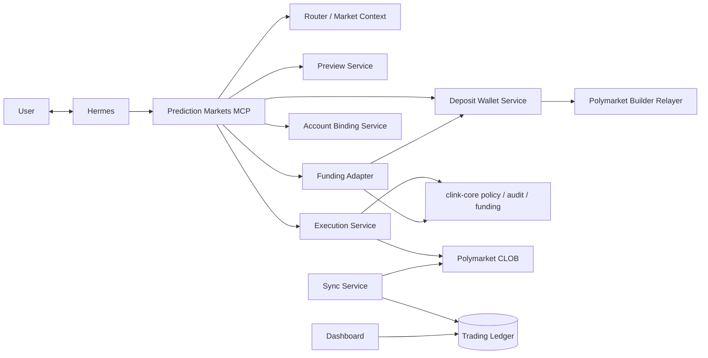

# clink-prediction-markets

`clink-prediction-markets` is the production vertical adapter for Hermes-led prediction-market trading.

用户和 Hermes 对话，让 Hermes 真实扫描市场并生成一条可追踪交易建议；用户确认后，Clink 真实执行；前端展示建议、资金、交易和盈亏。

## Production Flow

```text
User <-> Hermes
-> search_prediction_markets / build_prediction_market_context
-> create_agent_idea
-> create_prediction_market_order_preview
-> create_polymarket_order_signing_session
-> user signs exact order in browser wallet
-> complete_polymarket_order_signing_session
-> sync_prediction_market_portfolio
-> dashboard shows idea, order, funding, position, PnL, audit trail
```

The dashboard is read-only observability. Trading decisions happen in Hermes. Signing happens in the wallet browser. Clink records and gates every state transition.

## Architecture



## Production Services

```text
prediction_markets_router_service          8040
prediction_markets_preview_service         8041
prediction_markets_execution_service       8042
prediction_markets_context_service         8043
prediction_markets_portfolio_service       8044
prediction_markets_sync_service            8045
prediction_markets_funding_adapter         8046
prediction_markets_account_binding         8047
prediction_markets_deposit_wallet          8048
prediction_markets_mcp_server              9040
prediction_markets_dashboard               4174
```

## Execution Modes

Production default:

```env
POLYMARKET_EXECUTION_MODE=browser_signed
```

In this mode, `.env` does not store the user's wallet private key. The user signs the exact Polymarket order in a browser wallet, then Clink submits the signed order and writes the execution/audit trail.

Server-side private-key execution is not part of the default product path. If a future institutional deployment needs it, wire it through a vault/service-account design rather than putting a user wallet private key in `.env`.

## Required Configuration

```env
PREDICTION_MARKETS_LIVE_MODE=true
PREDICTION_MARKETS_REQUIRE_USER_CONFIRMATION=true
PREDICTION_MARKETS_REQUIRE_FUNDING_BEFORE_EXECUTION=true

PREDICTION_MARKETS_EXECUTION_CONSOLE_BASE_URL=http://<public-ip>:8042
PREDICTION_MARKETS_ACCOUNT_BINDING_CONSOLE_BASE_URL=http://<public-ip>:8047
REDIS_URL=redis://127.0.0.1:6379/0
CLINK_CREDENTIAL_ENCRYPTION_KEY=<fernet-key>

CLINK_CORE_ACTION_SERVICE_URL=http://127.0.0.1:8016
CLINK_CORE_POLICY_SERVICE_URL=http://127.0.0.1:8015
CLINK_CORE_AUDIT_SERVICE_URL=http://127.0.0.1:8017
CLINK_CORE_FUNDING_SERVICE_URL=http://127.0.0.1:8018
CLINK_CORE_ACCOUNT_SERVICE_URL=http://127.0.0.1:8019
CLINK_CORE_INTERNAL_API_TOKEN=<same-secret-as-clink-core>

POLYMARKET_EXECUTION_MODE=browser_signed
POLYMARKET_CLOB_HOST=https://clob.polymarket.com
POLYMARKET_SIGNATURE_TYPE=3
POLYMARKET_CHAIN_ID=137

POLYMARKET_RELAYER_URL=https://relayer-v2.polymarket.com
POLYMARKET_BUILDER_API_KEY=<builder-api-key>
POLYMARKET_BUILDER_SECRET=<builder-secret>
POLYMARKET_BUILDER_PASS_PHRASE=<builder-passphrase>
```

Exact funding and order amounts are authorized by the current Core Spending Mandate; Prediction Markets does not maintain a second per-order deployment limit.

`clink-prediction-markets` does not hold the x402 facilitator relayer key. Production funding settlement is owned by `clink-core` through `CLINK_CORE_FUNDING_SERVICE_URL`. The dashboard and MCP readiness read `/funding/readiness` from core and surface the active settlement rail, such as `clink_native_facilitator`, its gas relayer address, and any missing runtime configuration.

Polymarket CLOB API credentials are user-scoped. The Polymarket account-binding console asks the user's wallet to sign the official CLOB L1 auth typed-data, then Clink derives the CLOB API credentials server-side, encrypts them, and stores them in Redis or the local credential-store file. Do not put a user's API secret or wallet private key in `.env`.

Polymarket funded-trading account data is user-scoped. Production flows should discover the user's Polymarket account during wallet-signed CLOB auth. If Polymarket does not return the needed account data, the console sends the user to Polymarket to finish account setup and then retries discovery. Do not ask users or Hermes to paste a deposit wallet in chat. Do not configure a global `POLYMARKET_DEPOSIT_WALLET_ADDRESS` for a multi-user deployment; it is only a local development fallback.

Funding route behavior:

```text
EOA mode
-> direct wallet trading
-> x402 funding is blocked unless a distinct deposit wallet is prepared

Deposit wallet / proxy / safe mode
-> x402 funding can target the resolved venue wallet
-> Clink still requires user wallet signature, policy, and audit gates
```

The deposit-wallet service checks builder-relayer readiness and stores derived/deployed wallet state. It does not invent a venue address. If relayer credentials are missing, MCP returns `configure_builder_relayer`; if builder credentials are present but the official builder-relayer SDK is not installed, MCP returns `install_builder_relayer_sdk`; if no distinct funding target is available, MCP returns `prepare_polymarket_deposit_wallet`.

Production x402 funding into Polymarket needs both pieces:

```text
POLYMARKET_RELAYER_API_KEY / POLYMARKET_RELAYER_API_KEY_ADDRESS
-> authenticates Clink to Polymarket Relayer using the key shown in Polymarket account settings

or POLYMARKET_BUILDER_API_KEY / SECRET / PASS_PHRASE
-> authenticates Clink using the builder-key flow

official builder relayer SDK
-> signs/derives/deploys the Polymarket deposit wallet correctly
```

Clink derives the expected deposit-wallet address from the bound owner wallet address using Polymarket's deterministic deposit-wallet algorithm. It does not need the user's wallet private key. Deployment uses a builder-authenticated `WALLET-CREATE` request through the Polymarket relayer. After deployment, x402 funding can target that distinct deposit wallet.

Clink intentionally blocks x402 funding when the user is still in plain EOA mode and no distinct Polymarket deposit wallet has been derived. That prevents fake “funding” where `from == to`.

When an older EOA/type-0 binding coexists with a ready Deposit Wallet, Hermes receives a type-3 signing URL from `create_polymarket_account_binding_link` before funding can begin. The link carries the authoritative Deposit Wallet resolved by Clink; Hermes does not supply the address.

Generate a Fernet encryption key for `CLINK_CREDENTIAL_ENCRYPTION_KEY`:

```bash
python3 - <<'PY'
from cryptography.fernet import Fernet
print(Fernet.generate_key().decode())
PY
```

## MCP Tools

```text
create_prediction_market_strategy
create_agent_idea
update_agent_idea
create_core_account_setup_link
create_polymarket_account_binding_link
get_polymarket_account_binding_status
get_prediction_market_user_readiness
check_polymarket_deposit_wallet_readiness
prepare_polymarket_deposit_wallet
fund_polymarket_from_spending_authorization
search_prediction_markets
score_prediction_market_opportunities
build_prediction_market_context
create_prediction_market_order_preview
get_prediction_market_order_preview
check_prediction_market_execution_readiness
create_polymarket_order_signing_session
complete_polymarket_order_signing_session
execute_prediction_market_order_preview
get_prediction_market_execution
sync_prediction_market_portfolio
get_prediction_market_portfolio_snapshot
create_polymarket_bridge_deposit_address
create_polymarket_bridge_quote
get_polymarket_bridge_status
get_latest_polymarket_bridge_status
prediction_markets_router_health
```

Funding is no longer a per-transfer signing-link flow. The user signs one Core spending mandate on the account page, including per-transaction, rolling one-hour, daily and total limits, scope, expiry and notification mode. Hermes then funds Polymarket through `fund_polymarket_from_spending_authorization` only after Core rechecks that mandate and reserves the exact amount atomically.

`get_prediction_market_user_readiness` exposes the active Core mandate and its remaining hourly, daily and total budget as the sole user-authorization source. Legacy funding authorization records are returned only as `legacy_funding_authorization` for settlement compatibility and must not be presented as a second spending cap.

The same Core mandate can authorize compatible Marketplace x402 purchases through Core's Universal Payer without a per-purchase wallet signature. That does not replace Polymarket's venue-specific CLOB authorization or policy-required order confirmation; prediction-market execution keeps those controls independent.

Core Account and Polymarket Account have separate responsibilities. Core is the only wallet-identity and shared spending-mandate authority. The Polymarket page reuses that exact Core wallet only to sign venue-specific CLOB authorization; it cannot bind a second wallet or create another mandate. Both session creation and completion reject any wallet that differs from the active Core wallet. `create_core_account_setup_link` only returns a short-lived, user-controlled Core page. Hermes must relay that URL and must never use shell or direct Core internal calls. The dashboard uses the same backend operation through `POST /clink/account/setup-link`.

`execute_prediction_market_order_preview` remains available as a policy gate, but Polymarket production execution goes through `create_polymarket_order_signing_session` and `complete_polymarket_order_signing_session` so the user signs the exact order in a wallet browser.

## Run

```bash
cp .env.example .env
cd dashboard_frontend && npm install && cd ..
bash run_demo.sh
bash run_demo_status.sh
```

Register with Hermes:

```bash
hermes mcp remove clink_prediction_markets || true
hermes mcp add clink_prediction_markets --url http://127.0.0.1:9040/mcp/
hermes mcp test clink_prediction_markets
```

Hermes operator mode:

```text
请读取并遵守 clink-prediction-markets/docs/hermes_operator_prompt.md。
从现在开始按这个 Operator 模式服务我的 Clink 项目。
```

If Hermes cannot read local files directly, paste the prompt from [docs/hermes_operator_prompt.md](docs/hermes_operator_prompt.md) into the conversation.

Remote machine:

```bash
ssh -i ~/.ssh/leo leo@34.21.192.151
```

## Verification

```bash
python3 scripts/context_unit_smoke.py
python3 scripts/order_preview_unit_smoke.py
python3 scripts/execution_unit_smoke.py
python3 scripts/polymarket_production_execution_mode_smoke.py
python3 scripts/polymarket_browser_signed_order_session_smoke.py
python3 scripts/polymarket_credential_store_unit_smoke.py
python3 scripts/polymarket_account_binding_clob_derive_smoke.py
python3 scripts/polymarket_executor_credential_store_smoke.py
python3 scripts/polymarket_account_binding_unit_smoke.py
python3 scripts/polymarket_deposit_wallet_service_unit_smoke.py
python3 scripts/polymarket_deposit_wallet_sdk_readiness_smoke.py
python3 scripts/polymarket_deposit_wallet_owner_derivation_smoke.py
python3 scripts/polymarket_deposit_wallet_raw_relayer_smoke.py
python3 scripts/fund_from_spending_authorization_mcp_unit_smoke.py
python3 scripts/portfolio_unit_smoke.py
python3 scripts/dashboard_design_smoke.py
```
